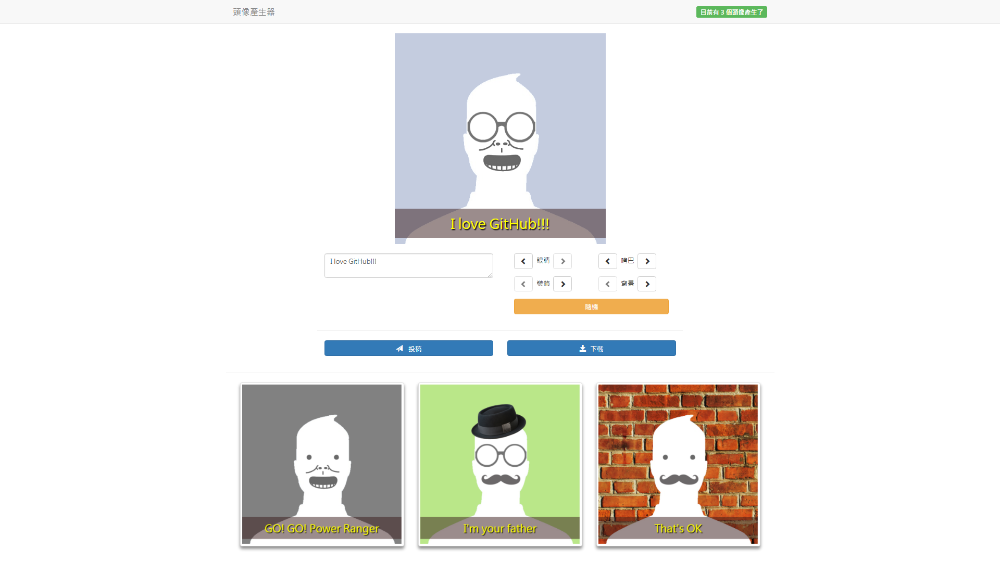

# [avatar-maker]

This is simple website which can make avatar by inputing text and selecting decoration. 
You can download avatar directly or just post the avatar. The avatar you post will save on server(folder called pictures) and show below the page.
You can also watch other people's avatar.

## Features

* The page is developed with VueJS framework.
* There is no database required.
* All avatar image will use timestamp as filename, so page can sort avatar list by created time.

## How to use

* Use `npm i` or `npm install` to install modules
* Use `npm start` to run server. Server is listening on `localhost:80`
* Use `npm run gulp` to run server for development. It will trigger nodemon and livereload